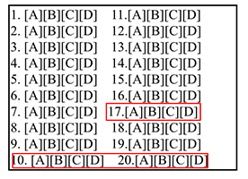
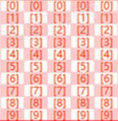
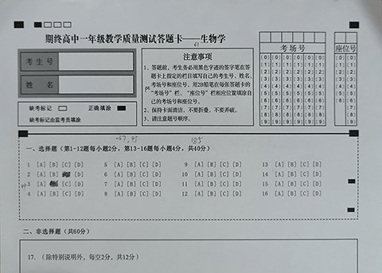
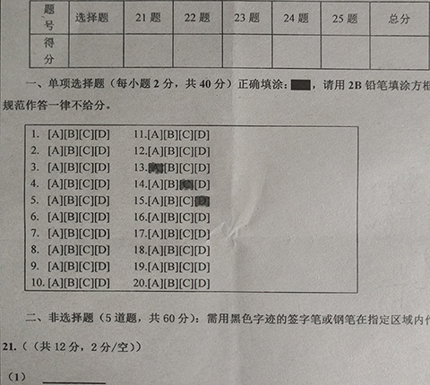

# 一、用途
这个安卓端的应用程序可用于扫描各种涂卡形式的选择题答案并进行计分。  

# 二、设计原理
本程序的设置列表较长，易用性低；了解原理有助于使用。  

## 扫描对象的预设
许多同类扫描程序会预设选择题的显示格式（例如：每个选项都使用封闭轮廓，由程序生成），以便于后续的扫描。  
印刷卷面与扫描程序相互适配，这似乎是许多应用的生态建成策略之一。  
而我制作本应用的初衷，就是尽可能降低对预设格式的依赖。  
以下是本程序对选择题卷面设计及扫描过程的要求：  
* 选项对齐：  
     
  △ 如上红框处选项没有对齐  
* 仅黑白、且像素均匀：  
     
  △ 如上这类底色不均匀的扫描对象，常见于各种硬质、有其他颜色的答题卡的考生号区域。  
  但是这类答题卡通常由专用机器扫描，无需使用本程序  
* 封闭方框：可以是框住所有选择题的封闭大外框，也可以是选择题区域附近的封闭方框；  
     
  △ 如上选择题区域外框一部分是虚线围成的非封闭区域，但上面的注意事项卡则是封闭的，可借用它进行定位。  
* 平整扫描：应该让卷面尽可能平整再进行扫描。实测是很容易办到的。  
* 横排选项：默认支持横排选项（即每题的ABCD从上到下排列）。竖排选项（即每题的ABCD从上到下排列）可在横屏逻辑中当作竖屏使用，但题序应该从右算起。

## 扫描过程：定位、拓印、黑格推理
opencv是一个伟大的发明。利用它，程序完成了以下过程：
### 定位
扫描选择题的第一步，要让机器能够**定位**到选择题区域。我们关注的区域分为**参照图区**和**原型图区**。参照图仅用于定位，而原型图是我们涂卡的区域（当涂卡区域本身具备封闭外框时，参照图区和原型图区应该设置为同一个区域，这会省去很多事情）。首先我们要在卷面上找出参照图最有可能在哪个地方，这里使用两种方法：**面积法**和**数轮廓法**。面积法是按照相机视野内最大面积的四边形轮廓来寻找的，数轮廓法则会找出视野内子轮廓（包括子轮廓的子轮廓等）最多的四边形轮廓。在从空白卷得出参照图时，机器会记录一串**参照图特征码**；随后每次扫描考生答题卡时，机器按特征码识别出参照图区，再按参照图区推理出原型图区位置。
### 拓印
机器找到原型图区以后，将原型图区的四角摆正，变换为正四边形之后截图。由于扫描开始时已经进入二值化模式，那么现在截取的原型图也是二值化的，即只有黑白二色，因而将该过程称为“**拓印**”。从空白试卷拓印原型图区，与拓印已作答试卷的原型图区，使用的是同一套方法；为了方便表述，我们称前者为**原型图**，后者为**真相图**。
### 黑格推理
在拓印得到的原型图中，应该预先分割涂卡区为多个单元格，每个单元格对应一个选项，这也是我们要求选项对齐的原因。为了获得考生的涂卡结果，我们在真相图中，对每个单元格的位置统计其黑色像素，规定**黑点数**（黑色像素个数）在某数值以上的单元格区域为“黑格”，这就是**黑格推理**。推理的过程是这样的，我将其称为“邻差法”：首先记录各单元格的黑点数，然后从小到大排序得到**黑点数递增数列**，跳过前几个单元格的数据，将黑点数突然有较大增多及之后的所有单元格记为黑格。
   * 为什么要跳过前几个单元格的数据？  
   因为考生有可能在更改答案时用力擦除，导致某些选项黑色像素减少。之后在识别“黑点数的突然增加”时，这种用力擦除导致的结果可能会使机器误判。
   * 如何衡量黑点数的突然增加？  
   我们使用**首阶陡然倍率**来衡量这一事实。这是一个倍率，指在黑点数递增数列中，后一单元格黑点数为前一单元格数据的倍率数值。之所以使用“倍率”一词，是为了兼容反色的扫描，实际上大多数时候我们面对的情况，都是使用2B铅笔填涂浅色底黑字的试卷，此时这个倍率大于1，准确来说应该称为“首阶陡然倍数”；另外，在黑点递增数列中从小往大搜索第一个黑格子，故称“首阶”，其实后续已涂单元格之间的差距可能大于首阶的陡然倍率。  
   * 如果原型图的每个选项固定就有较大的像素差异怎么办？  
   例如这样的答题卡：1.[一] [口] [品] [龘]  
   这是一种像素不均匀的设计。应该针对这种答题卡调整**无用阶定义**，设置黑格的黑点数下限。由于这类答题卡较少，一般情况下，无用阶定义值应当设置为较小的值（比如0或1）。

## 给分表达式
本程序尽可能地适配多种类型的选择题，包括但不限于：单选、双选、多选、不定项选择等。  
选择题给分时，按照以下三个数量给分：  
* 【对选】对了的选项，考生已选；  
* 【漏选】对了的选项，考生未选；  
* 【错选】错了的选项，考生已选。  

### 给分表达式的完整格式：  

      【生效题量q】【:】【扣分下限min】【~】【得分上限max】【得分式】【扣分式】
      多个表达式之间用逗号或换行隔开。为兼容汉字输入环境，冒号、波浪号、逗号不区分全半角，无关字符会被自动忽略。

解释：总共有q道题使用该设定，按得分式和扣分式计算分数。得分式和扣分式都可以忽略。  
上下限如果忽略不写，代表无限（~必须写）。得分范围为0到max，扣分范围为-min到0。min前面不可以添加-号！  
### 得分式
有如下三种：  
   1. 经典式：`【+或-】【单元分c】`对一个答案+c分，或漏一个答案-c分  
   2. 二阶式：`【%】【半对分h】`针对所谓的半对（即有对选、有漏选、无错选），给h分  
   3. 多阶式：`【/】【第1阶】【/】【第2阶】【/】【第3阶】【/】【第4阶】【/】...【/】【第n阶】`  
   每一阶都用“单元阶式”描述，允许不按顺序写出单元阶式。  
   以上给出的n代表“阶”数，每一阶的阶数就等于正确选项的总个数。  
   单元阶式格式：`【c1】【c2】【c3】...【cn】`  
   每个单元阶式一定有n个对选给分c，每个c都是一个数字，  
   其位数d与max相同（如果省略了max，则默认d=1），不足d位则前置补0到足够d位。  
   多阶式可以囊括几乎所有评分形式。然而，由于写法繁琐，应该仅在多选题或不定项选择题中使用它。  
### 扣分式
有如下三种：  
（注：扣分有可能无视0分下限，但不能低于-min。倒扣分常见于某些竞赛题）  
   1. 有错无视：`【*】`没有这个符号时，有错选会将该题重置为0分再进行扣分。有\*则取消该功能。  
   \*可与以下任一类型共用，写在其前面或后面，或单独使用。  
   据此，得分一定是从0开始计算得分，而扣分则在无\*时从0开始计算，有\*时则在得分后开始计算扣分。  
   2. 有错终扣：`【@】【倒扣分d】`代表无论有几个错选，直接扣d分。  
   3. 错一扣一：`【#】【倒扣分d】`代表每错选一个，就扣d分。  
### 给分表达式范例
以下选择题都各有四个选项；  
第1-10题为单选题，每题2分；  
第11-15题为双选题，每题有两个正确选项，选对一个得2分，选对两个得4分，有错选不得分；
第16-20题为多选题，每题有两个或两个以上正确选项，有选对且漏选得2分，全部选对得4分，有错选不得分；
第21-24题为不定项选择题，每题有一个或一个以上正确选项，每题总分为4分；有漏选、无错选时：如果正确选项有两个，选对一个得2分；如果正确选项有三个，选对一个得1分，选对两个得2分；如果正确选项有四个，则选中每个选项都得1分。有错选不得分。  
那么，这里的给分表达式应该写为：

      10:0 ~ 2 + 2,
       5:0 ~ 4 + 2,
       5:0 ~ 4 % 2,
       4:0 ~ 4/4/24/124/1234

# 三、使用流程（详版）
## 设置
打开程序后首先是竖屏的设置界面。  
第一次进入本程序时，推荐在设置好“相机设置”以后就“点击开始”，所有项目都保持缺省即可（程序会自动使用默认值）。  
设置项包括以下内容：
### 扫描方案
**【导入】** 用于导入序列化之后的扫描方案。  
**【导出】** 用于导出序列化之后的扫描方案。  
**【重置当前方案】** 用于重置当前的扫描方案到默认值。  
**【使用说明】** 用于查看本说明。  
**【点击开始】** 用于点击进入扫描界面。  
**【退出程序】** 用于退出程序。  

### 相机设置
**【相机API】** 安卓系统支持的相机API有android.hardware.camera和android.hardware.camera2两种。  
我们将前者称为camera1，后者为camera2。虽然本程序要求在安卓版本5.0及其以上才可安装使用，但camera1仍旧受支持。  
**【相机ID】** 尽管不太可能，还是提供了前置相机的调用。正常情况下请选择后置摄像头。  
**【相机画面尺寸】** 即分辨率。实测1K时会有明显卡顿。分辨率设置低时，画面像素点粗大；作为参考，我的红米note 8 pro使用的是1280x720，能看得清但又不卡顿。  
**【相机帧率】** 默认每20帧扫描一次。推荐10帧/秒就足够了。  

### 参照图及原型图位置尺寸（双区设置）
双区设置是为了准确定位及固定显示比例。在设置之前，请先拿出尺子和试卷，参考以下案例获得各项数据。  
  
△ 如上，“注意事项”框是参照图区，“选择题”框是原型图区。用尺子量得参照图宽高为61x40，原型图宽高为185x44，默认参照图区左上角坐标为（0,0）（不需要填写），则原型图区左上角坐标为（-67,45）。注意，这里使用的平面坐标与数学上的有些许不同，x轴同样是向右增大，但y轴是向下增大。以上单位全部使用mm，实际上不管你使用哪种尺子、得出的是什么数字，只要全部统一单位即可填写设置。  
  
△ 如上，选择题区域拥有外框，此时参照图区与原型图区可以重叠。用尺子量得参照图、原型图宽高均为171x100，原型图因与参照图重叠，故而其左上角坐标为（0,0）。  
**【点击逆转90度】** 一些选择题如果是长条形排列的，可能更适配竖屏扫描。例如，上面的两个例子均为横屏扫描，如果要转为竖屏扫描，则双区设置要重新改动，使用这个按钮可以逆转90度自动改变数字，点击一次即可改为竖屏。如果要从竖屏改回横屏，应点击三次。

### 扫描器设置
**【扫描间隔】** 默认为每20帧扫描一次。建议不要更改。  
**【参照图定位模式】** 分为面积法和数轮廓法。详见本篇说明的“设计原理”。  
**【二值化扫描块大小】**、**【C值】** 图片二值化过程中的参数。  
**【相似图判定容许偏差】** 衡量扫描到的参照图区与已识别过的参照图最大能有多少差异。大于这个差异的，认为不相似。  
**【参照图特征码】** 参照图的特征码。详见本篇说明的“设计原理”。  
**【黑格推理模式】** 分为邻差法和对比法。邻差法的详情，请参考本篇说明的“设计原理”；对比法还待完善，请勿使用。  
**【邻差法起始索引】**、**【无用阶定义】**、**【首阶陡然倍率】** 详见“设计原理”。  

### 网格编辑工具
**【所有网格特征码】** 罗列了所有附加于原型图的答案网格，点击可以直接更改。网格是将各个选项的所在范围定位、分割出来的工具。有关这一部分的内容，请参考下面的“扫描”。  
**【当前对象】** 选择当前要编辑的对象。  
**【答案】** 点击可以切换答案是按横屏还是按竖屏显示。  
**【给分表达式】** 点击编辑给分表达式。详见“设计原理”。  

## 扫描
### 界面介绍
在“点击开始”之后进入扫描界面。扫描界面包括一个相机预览画面、以及浮在预览上方的半透明面板，面板上有三个按钮和一个提示文本显示栏。如下：  
.jpg "")  
注意，扫描界面始终是横屏的，但可以作竖屏使用。详情请参考下文。  
1. 背景是**相机预览画面**，此时摄像头是打开状态，这里呈现其内容，绿色框线代表正在扫描轮廓；  
点击画面出现**对焦按钮**并自动对焦；  
在画面上方滑动手指，其他UI会消失，程序也会停止扫描（绿色框线消失），再滑动一次则恢复正常。  
1. 齿轮状的图标是**设置**，未进入扫描结果页时，点击设置会返回设置页。  
2. 白色的圆形按钮是**拍照**，除了拍照（拓印）功能，在进入扫描结果页之后，具有退出页面的功能。  
3. 三色按钮是**模式切换**，点击可切换**MAN**（手动拓印）、**AUT**（自动拓印）、**PRT**（拓印原型）。  
4. 右边显示红色文字的是**提示文本**，点击可切换文本的显示角度。
5. **半透明面板**同样可以点击，在未进入扫描结果页时，点击会进入**原型图显示页**；  
在扫描结果页中，点击半透明面板则会隐藏UI。

扫描界面附加两个**扫描结果页**。  
1. 首先是**原型图显示页**。这个页面显示已经扫描到的原型图，手指在页面上拖动可以绘制答案网格。  
2. 另外一个是**真相图显示页**。这个页面显示已经扫描到的真相图和已有的答案网格，并在提示文本中显示总分。  

以上页面中，点击半透明面板可以隐藏UI，点击拍照按钮可以退出。  

### 扫描过程（1）获取参照图特征码、原型图内容
如果没有导入序列化的扫描方案，或没有事先的设置，那么默认的参照图特征码和原型图内容都是空白的。我们需要从现实中获取它们。  
首先点击三色按钮切换到绿色的PRT模式，将画面对准参照图区，点击拍照按钮获取原型图。  
注意画面要将原型图区囊括在内，否则程序无法得知相机画面以外的内容。  
.jpg "")  
不必强求绿色方框对准参照图的外框。它一定会截取到最正确的画面。  
.jpg "")  
拍照后，程序会自动进入原型图显示页。另外，在未进入扫描结果页时，无需扫描，直接点击半透明面板，同样可以到达原型图显示页（前提是已经存储过原型图，否则将不可进入）。  
进入原型图显示页之后，如果发现界面UI已经挡住原型图了，我们可以点击半透明面板隐藏UI。这在绘制答案网格时，非常有用：  
.jpg "")  
画面上方出现了一个黄色透明的对焦按钮，可以将其拖动到任意位置，再次点击它（不要拖动）又能重新显示UI。  
以上演示的是“双区异位”（即原型图区与参照图区不同）的答题卡。
推荐将二者做成同一区，并外套封闭方框。这样的原型图无论是设置或扫描都比较容易：  
.jpg "")  
横屏不是强制使用的。上图（横屏）的双区设置数字依次为61、40、61、40、0、0  
你仍旧可以使用竖屏进行拍照，但需要注意的是，这仅仅是逻辑上的竖屏，而非事实的竖屏，故而图区的宽高和坐标等仍旧是以横屏计算的。在双区设置时点击逆转，将设置数字改为40、61、40、61、0、0，以进行扫描：  
.jpg "")   
竖屏的扫描结果：  
.jpg "")  

### 扫描过程（2）绘制答案网格
这么做是为了定位每个选项，以方便后边统计像素并计算差异和得分。我们以下面这张扫描结果（原型图显示页）为例：  
.jpg "")  
你可能注意到了，图上有三个已经填涂的选项，这是否会影响后面的扫描呢？  
答案是：实际并不影响。获取参照图/原型图时并不强制使用未填涂的空白答题卡；像上例的双图区重叠，我们有一个设置项 **【相似图判定容许偏差】** 可以调整相似图判定，以保证即便随着答卷变化，也大致能判定扫描对象为同样的参照图。至于原型图，除了本程序未开发的对比法，仅剩下为答案网格提供定位依据的用处。  
在原型图显示页，手指拖动可在其上绘制答案网格：  
.jpg "")  
这是初始状态。在网格上面任意处滑动，会显示网格控制按钮（注意，即便你认为自己正处于竖屏的工作状态下，图标的位置和方向也始终不会改变，始终以横屏为准）：  
.jpg "")  
左上角是切换模式，目前是粗调模式；  
\+、\-是增减网格行列数；  
双箭头是大小调整按钮；  
中间的十字是移动位置按钮。  
首先，我们应该点击\+、\-号进行网格行列的调整：  
.jpg "")  
然后按住相关按钮，调整大小和位置：  
.jpg "")  
现在点击切换到微调模式，右下角有个竖屏的“正”字：  
.jpg "")  
点击“正”字定义这个网格的逻辑为横屏：  
.jpg "")  
如果你对当前的网格不满意，可以点击中间的十字，能在关闭按钮和“正”字之间来回切换：  
.jpg "")  
微调模式的其他按钮基本一看就知道含义，也很少用到，就不做介绍了。  
再次点击切换模式，这是一开始默认的编辑模式：  
.jpg "")  
点击单元格，制作标准答案。如上1~10题的答案为ABCDABCDAB  
再制作一个网格：  
.jpg "")  
点击拍照按钮，回到扫描界面，就存储好这个答案网格了。  

### 扫描过程（3）编辑给分表达式
此时点击齿轮，回到设置界面，拉到最下边：  
.jpg "")  
在“所有网格特征码”一栏中，如果你看得懂的话，是可以直接加工答案网格的。但通常这些事都在（2）中完成了。  
如果一定要自己编辑，请参考源码。  
比较有用的是以下做法：  
点击“当前对象”，可以选择要编辑的网格对象：  
.jpg "")  
然后就可以点击“答案”很方便地将字面答案（ABC...）在逻辑横竖屏间切换了：  
.jpg "")  
例如，这里将原来横屏的ABCDABCDAB切换为竖屏的JFB,IEA,HD,GC  
最后的给分表达式一定要编辑。它涉及到给分标准。  
你可以在“所有网格特征码”或这里编辑，编辑时要清楚它对应的是哪个网格。  

### 扫描过程（4）扫描选择题答卷
在扫描界面，对准答卷进行扫描，这和（1）过程是相似的。  
点击三色按钮，切换到MAN模式时，每次必须点击拍照按钮才能进入真相图显示页；切换到AUT模式时，只要检测到参照图区，立刻自动进入真相图显示页。此外二者无区别。  
在真相图显示页，许多特征和原型图显示页一致，但是不能自己增加网格：  
.jpg "")  
可以看到红框将考生的答案框选了起来，并在提示文本中给出了得分。同时，标准答案也会显示，作为参考。  
如果认为扫描结果很不准确，应该回去设置页，调整“二值化扫描块大小”“C值”“邻差法起始索引”“无用阶定义”“首阶陡然倍率”，以期望较少调整这些数值为最佳状态。  
如果仅仅是偶然不准确，那么可以点击单元格标记或取消红框，程序会自动重新计分：  
.jpg "")  
点击拍照按钮，即可进行下一次答卷扫描。  

# 四、使用流程（简略版）
需要准备：
1. 一部安卓手机，安卓版本5.0版本以上  
2. 安装本程序  
3. 一个会使用这个程序的高手  

打开程序之后，先进行相机设置，使“点击开始”按钮亮起，然后找高手导出序列，复制这个序列，点击“导入...”把这个序列粘贴进去，就可以开始“扫描过程（4）”了。

# 鸣谢
* 通义（无所不知！）
* opencv（哥！）
* github（开源精神！）

# 开发后记
查卷始终是一件麻烦的事情！每次查卷，我就头昏脑胀，睡意不绝。以前没有扫描查卷的时候，我们把选择题答题卡剪下来，用香烫出标准答案，蒙上去计分，这还算是容易的；查填空题，我常常遇到一些长句子，然后便反复读取考生答案，同时大脑一片空白。这事对于别人来说怎么样我并不清楚，但对于我来说实在是太痛苦了。  
后来有了扫描查卷这回事，我就一直想着我也来做一个。最初也只是想想而已。  
在我的开发计划中，我已经有了很全面的开发思路，包括选择题、填空题等。查选择题就是现在发布的这个程序；查填空题，就是把所有考生的试卷都扫描一遍，同一题同一个空的答案都集中展示到一起，这时候查卷人只要在每个考生的答案上面点击给分就行了；最后每题都查完，拿摄像头对准试卷，在电脑屏幕上的摄像头画面上层显示给分状况，按顺序一张张显示，查卷人拿个红笔在有给分标记的地方打勾抄评分。  
我原本想在.net平台利用高清摄像头来进行pc查卷，对于我这种人来说相对更好开发。然而，很多查卷人并没有为了查卷购置一个pc用高清摄像头的欲望，我认为即便开发出成品也没有用处。我尝试过不少方法，例如安卓手机推流摄像头画面到pc，或者使用scrcpy，但都不得要领，要么延迟大，要么集成困难。我只是一个查卷工、一个业余的计算机爱好者，这些对我来说太难了。  
后来我尝试了安卓应用开发，还真别说，一入坑就不吱声了，第一天安装Android Studio下依赖下了一整天，生啃java也费了一些时间，还好这个年代有AI，不然也只能做梦开发自己的机器查卷程序。  
别问我为什么不用别人家写好的软件，我只知道现在免费用，将来就不一定了。  
除了这个，我真的很想把填空题的程序也写出来。但我的时间太琐碎，我的精力也总是跟不上，甚至视力都快跟不上了。现在一看屏幕，连续看半个小时就发困，有时候甚至眼睛干涩。  
我希望有更多人愿意把自己的作品拿出来分享，所以我开源了这个程序。我对java和安卓都是初次接触，写得并不好，很多地方没有精力去解耦。但我很快乐，我终于不是那个整天说说而已的人了。
最后，感谢通义，它解决了我很多琐碎的疑惑。在很多个打不开GitHub的夜晚，在无数个倒腾外网资源的网站中，AI给了我很多温暖的解答。  